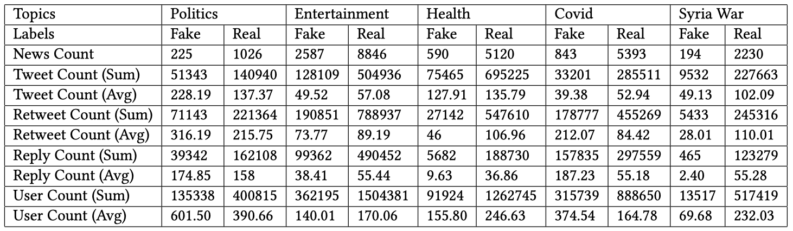

## Divide-and-Conquer: Post-User Interaction Network for Fake News Detection on Social Media

In this work, we formulate social context based fake news detection as a heterogeneous graph classification problem, and propose a fake news detection model named Post-User Interaction Network (PSIN), which adopts a divide-and-conquer strategy to model the post-post, user-user and post-user interactions in social context effectively while maintaining their intrinsic characteristics. Moreover,we adopt an adversarial topic discriminator for topic-agnostic feature learning, in order to improve the generalizability of our method for new-emerging top-ics. Furthermore, we curate a new dataset for fake news detection, which contains over 27,155 news from 5 topics, 5 million posts, 2 million users and their induced social graph with 0.2 billion edges. It has been published on https://github.com/qwerfdsaplking/MC-Fake. Extensive experiments illustrate that our method outperforms SOTA baselines in both in-topic and out-of-topic settings.

- Motivation
- Method
- Key Results
- Code and Datasets
- Contributors
- References

###Motivation

Fake News detection has attracted much attention in recent years. Social context based detection methods attempt to model the spreading patterns of fake news by utilizing the collective wisdom from users on social media. This task is challenging for three reasons: (1) There are multiple types of entities and relations in social context, requiring methods to effectively model the heterogeneity. (2) The emergence of news in novel topics in social media causes distribution shifts, which can significantly degrade the performance of fake news detectors. (3) Existing fake news datasets usually lack of great scale, topic diversity and user social relations, impeding the development of this field.

###Dataset
To obtain reliable ground truth labels on veracity of news, the most common solution is to utilize fact-checking websites such as PolitiFact, Snope and so on. There are already many previous work along this line of research. Therefore, we do not repeat this actions, instead, we collect labelled fake news from existing datasets and collect real news from reliable sources. We conduct a uniform filter criterion to select reliable instance. Then we retrieve related tweets, retweets and replies, with the corresponding users on the Twitter platform. The “following” relationship between users are also retrieved to obtain the induced user network. 

After the data retrieval and construction, we obtain a fake news dataset with 27,155 news events from five topics: Politics, Enter-tainment, Health, Covid-19 and Syria War, 5 million posts, 2 million users and an induced user social graph with 0.2 billion edges. Table 1 illustrates the statistics of collected datasets. Here we compare the distributions of tweets count, retweets count, reply count and user count to illustrate the difference between fake and real news. 

In this section, we introduce our proposed Post-User Interaction Network (PSIN). Although the posts and users constitute a heterogeneous graph, their intrinsic characteristics limit the effectiveness of off-the-shelf heterogeneous graph models. For example, the tree structures of post-post subgraph is quite different from the directed user-user subgraph. To solve these issues, we design an organized learning mechanism based on divide-and-conquer strategy to integrate different aspects while maintaining their intrinsic characteristics. Generally, we decompose the original graph into three parts: post propagation tree, user social graph and post-user interaction graph and process them individually, then, we perform the integration process at the end. As illustrated in Figure 3, our model generally includes five parts: Hybrid Node Feature Encoder (HNFD) for node representation, Tree Graph Attention Network (Tree-GAT) for post tree modeling, Relational Graph Attention Network (R-GAT) for user graph modeling, a post-user fusion layer for information interaction based on user behaviours, and a veracity classifier with an additional adversarial topic discriminator for topic-agnostic model learning.

###Key Results

###Code and Datasets
We release our dataset on GitHub.

###Contributors

###References

